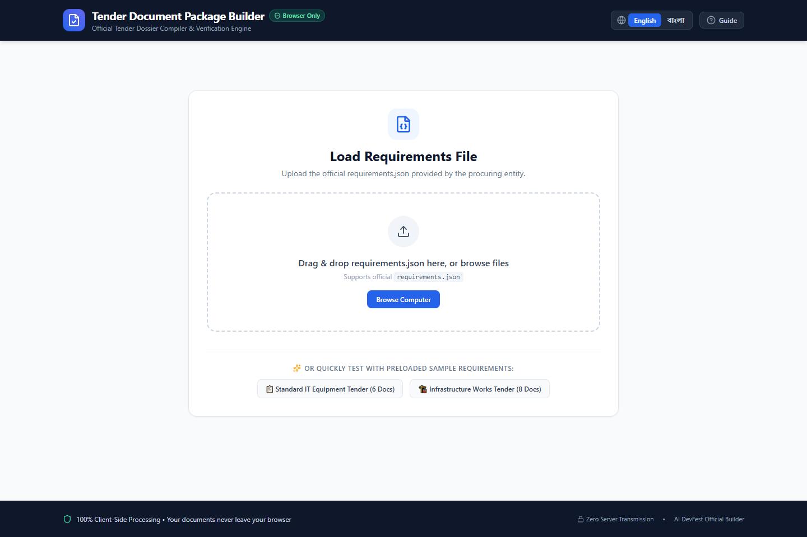
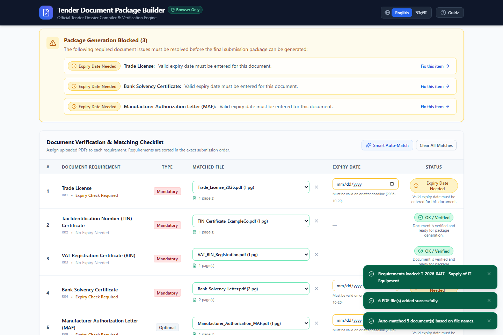
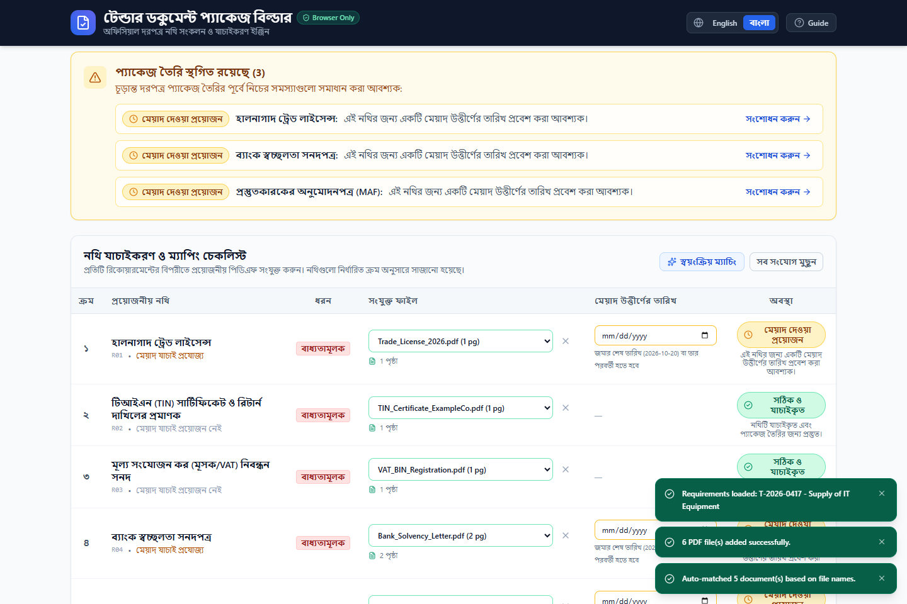
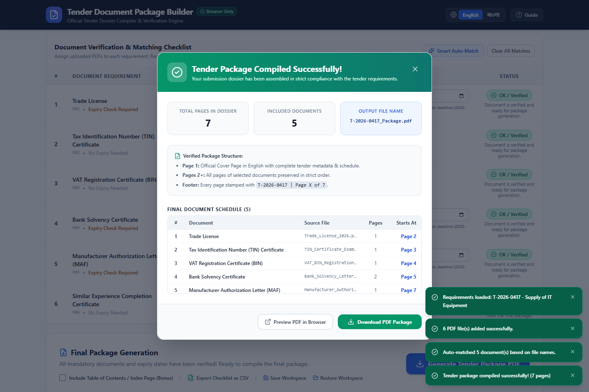

# TenderPack — Tender Document Package Builder

> Official Submission for the **AI DevFest Hackathon** — Frontend Category  
> 🌐 **Live Demo**: [https://tender-pack.vercel.app](https://tender-pack.vercel.app) *(Mirror: [tenderpack-app.vercel.app](https://tenderpack-app.vercel.app))*  
> **Author**: Eftakhar Amin Sakib ([eftakhar.x.sakib@gmail.com](mailto:eftakhar.x.sakib@gmail.com))  
> **License**: [MIT](./LICENSE)

---

## 💡 About the Project

Preparing bid dossiers for public or corporate tenders is notoriously tedious. Office staff often spend hours manually reviewing requirements, checking trade license or bank solvency validity dates, sorting documents into the exact order requested by the procuring entity, and praying that no duplicate or expired document slips through. A single mistake—like submitting a certificate that expired yesterday or placing documents out of order—can get a bid disqualified on technical grounds.

I built the **Tender Document Package Builder** to solve this exact problem. It's a clean, reliable, and completely client-side web application where non-technical staff can load an official `requirements.json`, upload their scanned PDFs, verify every requirement interactively, and export a stamped, compliant submission dossier in seconds.

### 🛡️ Why 100% Client-Side?
Tender documents are confidential business records (financial statements, trade licenses, OEM agreements, proprietary proposals). Uploading these documents to third-party cloud servers or external databases poses compliance and privacy risks. 

In this application:
- **Zero server uploads**: All file parsing, cryptographic hashing, page counting, and PDF merging happen right inside the user's browser.
- **Web Crypto API**: SHA-256 content hashes are calculated locally using the browser's native crypto engine.
- **In-memory manipulation**: Document pages are merged and stamped via `pdf-lib` without any data ever leaving the device.

---

## ✨ Key Features & Requirements Walkthrough

### 1. Requirements Loader & Schema Normalization
- Accepts any valid `requirements.json` provided by the procuring entity.
- Tolerates both `snake_case` (official schema: `tender_id`, `procuring_entity`, `submission_deadline`, `has_expiry`, `title_en`, `title_bn`) and `camelCase` variations so it seamlessly parses unseen test packs.
- Validates calendar dates strictly in `YYYY-MM-DD` format (with proper leap year checks).
- Displays documents strictly ordered by their required `order` sequence.

### 2. Multi-PDF Upload & Inspection
- Supports multi-file selection and drag-and-drop.
- Strictly accepts PDF files only: checks file extensions and validates **PDF magic bytes (`%PDF-`)** to prevent renamed non-PDF files from crashing the system.
- Enforces problem constraints: up to 30 files and a maximum 50 MB total upload size.
- Real-time page counting and file size display.
- Safely catches corrupted or password-protected PDFs with user-friendly warnings.

### 3. Cryptographic Duplicate Detection (SHA-256)
- Identifies duplicate documents by their actual byte content, **never by filename**. Even if someone names the files `Trade_License.pdf` and `Scan_Copy_Final_2026.pdf`, if the content is identical, the system flags it.
- Clearly tags duplicates in the file pool.
- **Strict Rule Enforcement**: Duplicate files cannot be assigned to different requirements.

### 4. Deterministic 5-Status Engine
Every requirement is continuously evaluated against the tender rules and assigned one of five unambiguous statuses:
- 🔴 **Missing** (Mandatory requirement, no file matched) → **Blocks compilation**
- 🟡 **Expiry Date Needed** (Expiry check required, file matched, no date entered) → **Blocks compilation**
- 🔴 **Expired** (Expiry date is strictly before the submission deadline) → **Blocks compilation**
- ⚪ **Not Provided** (Optional requirement, no file matched) → **Does NOT block** (omitted from the final PDF)
- 🟢 **OK / Verified** (Document matched and valid; expiry on or after deadline) → **Does NOT block**

> *Note*: If a document expires **on the exact day** of the submission deadline, it is treated as **OK**, strictly matching the competition rules.

### 5. Gated Generation & Real-Time Feedback
- The "Generate Tender Package PDF" button stays locked whenever any document has a blocking status.
- A prominent alert banner outlines the exact issues requiring attention with a quick "Fix this item" button that scrolls directly to the row.

### 6. Compliant PDF Package Compilation
The output PDF follows the competition specification to the letter:
- **Page 1 (Cover Page)**: Clean, official English cover page containing Tender ID, Title, Procuring Entity, Bidder, Submission Deadline, creation date, and the included document schedule.
- **Bonus Index Page (Table of Contents)**: Calculates and lists accurate starting page numbers for each included document.
- **Document Pages**: All pages of each selected file are included in their original sequence, ordered by requirement `order`.
- **Footer System**: Every single page (including Cover and Index) receives a neat footer at the bottom: `<tender_id> | Page X of Y` (e.g. `T-2026-0417 | Page 7 of 8`) positioned so it won't obscure content.
- **Output Filename**: Automatically downloads as `<tender_id>_Package.pdf`.

### 7. Bilingual Interface (English & বাংলা)
- Built for real office environments where staff prefer working in Bangla or English.
- Instant language toggle at the top.
- Document titles dynamically switch between `title_en` and `title_bn`.
- All table headers, status descriptions, error dialogs, and numbers update accordingly.

### 8. Bonus Features Implemented
- 🎯 **Smart Auto-Match**: Suggests matches based on filename tokens and keyword heuristics with duplicate safety.
- 💾 **Workspace Save & Restore**: Save matching progress to a local `.tender-session.json` file and reopen it later.
- 📊 **CSV Checklist Export**: Download a checklist table (with UTF-8 BOM for Excel support) showing requirement, filename, page counts, expiry date, and status.
- ⚡ **Instant Sample Data Playground**: One-click buttons to load sample tenders and generate mock PDFs right in the browser for hassle-free evaluation.

---

## 📸 Screenshots

| 1. Requirements Loader & Samples | 2. Checklist & Statuses (English) |
|:---:|:---:|
|  |  |

| 3. Bilingual Interface (বাংলা) | 4. Compiled Package Modal |
|:---:|:---:|
|  |  |

---

## 📁 Repository Deliverables (Section 9)

As required by Section 9 of the competition problem statement:
- **Generated Package**: [`output/T-2026-0417_Package.pdf`](./output/T-2026-0417_Package.pdf) — generated from the sample pack after resolving all issues.
- **Screenshots**: Stored in [`screenshots/`](./screenshots/) covering the requirements loader, English status view, Bangla translation, and final compilation modal.
- **Sample Pack Data**: Provided in [`public/sample-pack/`](./public/sample-pack/) for quick testing.

---

## 🧪 Testing & Verification

The project includes an automated test suite with **23 test cases** checking core rules, edge cases, and guardrails:

```bash
# Run Vitest test suite
npm test
```

### Verified Test Cases:
1. `Missing` status triggered when mandatory document has no file.
2. `Not provided` status triggered for optional document with no file (does not block).
3. `Expiry date needed` status triggered when file matched but date is blank.
4. `Expired` status triggered when expiry date is strictly before deadline.
5. Expiry exactly on deadline evaluates to `OK`.
6. Expiry after deadline evaluates to `OK`.
7. Non-expiring documents evaluate to `OK` upon matching.
8. Optional documents with valid expiry evaluate to `OK`.
9. Duplicate content detection using Web Crypto SHA-256.
10. Same content with different filenames correctly identified as duplicate.
11. Duplicate files cannot be matched to different requirements.
12. Match unassignment and reassignment behavior.
13. File removal unlinks any active requirement matches.
14. Strict ascending order sorting of requirements.
15. PDF magic bytes inspection (`%PDF-`) rejects spoofed files.
16. Calendar validation and leap year safety (e.g., `2026-02-29` rejected).
17. Maximum 30 files enforcement.
18. Maximum 50 MB total upload size enforcement.
19. Official English cover page generation as Page 1.
20. Footer `<tender_id> | Page X of Y` stamped on every single page.
21. Accurate total page count and document order preservation.
22. Output file naming strictly formatted as `<tender_id>_Package.pdf`.
23. Full programmatic verification of the final output PDF via Python script (`scripts/verifyFinalPdf.py`).

---

## 🚀 Getting Started

### Prerequisites
- Node.js 18+ (tested on Node.js v24 LTS)
- npm 9+

### Installation & Run
```bash
# Clone the repository
git clone https://github.com/EFTAKHAR-AMIN-SAKIB/tender-document-package-builder.git
cd tender-document-package-builder

# Install dependencies
npm install

# Start development server
npm run dev
```

Open [http://localhost:5173/](http://localhost:5173/) in Google Chrome.

### Building for Production
```bash
# Build production bundle
npm run build

# Preview production build locally
npm run preview
```

---

## 🛠️ Tech Stack

- **Framework**: React 19 + TypeScript
- **Build Tool**: Vite
- **Styling**: Tailwind CSS
- **PDF Engine**: `pdf-lib` (pure browser-side manipulation)
- **Hashing**: Web Crypto API (`crypto.subtle.digest` SHA-256)
- **Icons**: Lucide React
- **Testing**: Vitest

---

## 📄 License

This project is licensed under the [MIT License](./LICENSE) — created by **Eftakhar Amin Sakib**.
